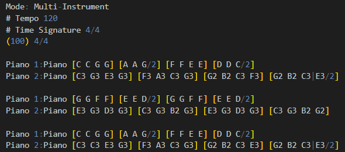

# Fluent Synth

This project provides a C# Fluent API music composition library for use in a scripting environment e.g. [Pure](https://github.com/pure-the-Language/Pure/). Many years ago when Haskell was still new they had [Euterpea](https://www.euterpea.com/) which is a fun concept but tedious to use because Haskell is hard to use, and music composition is inherently a procedural thing so a functional approach is not the best way to model it.

Main inspirations:

0. Arguably the main inspiration is [MultiFractalTerrain API](https://github.com/Charles-Zhang-Project-Nine-Experiments/MultiFractalTerrain) which has the potential to provide full suite of World Machine capabilities in a programmable and open-source fashion and is a proof-of-concept of Pure-based Fluent scripting fluency. 
1. NAudio for audio playback and raw waveform assembly.
2. [MeltySynth](https://github.com/sinshu/meltysynth) for MIDI assembly.

The [Core library](./Core/FluentSynth) will provide preliminary FluentSynth for Pure-oriented MIDI-supported but more targeting raw waveform procedural generation

Example:

```FluentSynth
# Twinkle Twinkle Little Star
# Tempo 120, Time Signature 4/4
(120) 4/4
[C C G G] [A A G/2] [F F E E] [D D C/2]
[G G F F] [E E D/2] [G G F F] [E E D/2]
[C C G G] [A A G/2] [F F E E] [D D C/2]
```

## Methodology (Preliminary Note)

This library provides raw API for manipulating and assembling sin waves and notes, and relies on NAudio for music playback. By reading or creating MIDI files on the fly, one can represent musical ideas on a higher level.

The library (FluentSynth) provide two sets of APIs: 1) For raw fixed-size waveform manipulation; 2) For MIDI-based synthesization aka. data-driven approach.

Being able to construct raw waveforms from scratch is useful for basic musical note and chord exploration, but for more efficient music composition, using scores and MIDI is more convinient.
The raw waveform based API also has the advantage that when used in a scripting environment it can be entirely procedural (though the same can be argued for MIDI based approach).

For musical scores, we use a partial and modified version of [Guido Music Notation](https://en.wikipedia.org/wiki/GUIDO_music_notation).

## Fluent Synth Music Notation (FSMN Score)

An entire composition is broken into **measures**, and each measure consists of **beats**. The default time signature is `4/4`.

For specifically, either single sequence of notes, or sequence of measures, or entire composition can be specified as input:

* Sequence of notes, separated by space: `c d e f g h a b`
* Sequence of measures: `[c d e f]`
* Entire composition (in a single line): `(120) 4/4 [C C G G] [A A G/2] [F F E E] [D D C/2] [G G F F] [E E D/2] [G G F F] [E E D/2] [C C G G] [A A G/2] [F F E E] [D D C/2]`

### Musical Notes

Musical notes can be represented using the typical diatonic musical notes as `A B C D E F G` or numerically as `1 2 3 4 5 6 7`, or as solfège: `do re mi fa sol la ti/si`.  
Note names are case-insensitive. Numerical and solfège specification are in the key of C. Note names never contain spaces.

When numerically or as solfège, one can use `'` as suffix to raise an octave and use `_` as suffix to lower an octave, e.g. `1'` is two octave higher than `1_`.  
When using English letters, one can use accidentals and numbers to denote which octave and tone the note is, e.g. `A#6` (MIDI 94) is piano key 74, and `C6` (MIDI 84) is piano key 64, also known as Soprano C (High C).

A complete note consists of three components: note name, velocity (also known as attack), and duration. The complete form looks like this: `<Note Name>/<Duration>@<Attack>`. E.g. `[c/1 c d/2 d e/4 e f/8 f g/16 g a/32 a]`.   
Notice durations are not sticky, and by default the note duration is the length specified in the denominator in the time signature.

### Duration

Default duration for a note is a quarter note. To indicate a different rhythm, indicate it after any octave indicator by writing a slash `/` followed by the duration of the note in terms of divisions per whole note: `[c/1 c d/2 d e/4 e f/8 f g/16 g a/32 a]`.

|rhythm|code|
|whole note|1|
|half note|2|
|quarter note|4|
|eighth note|8|
|sixteenth note|16|
|thiry-second note|32|

### Chords

A note can be played together with other notes at the same time by using `|` to connect them. E.g. (Middle C, E, G with different attacks) `C|E|G/4@100`; When specified in this fashion, the notes must have the same duration and velocity.

### Accidentals

Sharps are indicated by a pound sign (#) and flats are indicated by an ampersand (&): `[c# d& e f# g&]`.

At the moment there is no capacity to parse something like `f##` or `g&&` - you need to manually convert it to `g` or `f`.

### Multiple Instruments

Syntax is slightly different from single-line measures.

The score must start with `Mode: Multi-Instrument` line.  
Then the next valid content line must specify tempo and time signature: `(120) 4/4`.  
One can use `#` to denote comment lines.

Each "group" line is like this: `<Group Name>:<Group Instrument> <Measures>`. The `<Group Name>:<Group Instrument>` part uniquely identify a group. It's possible to have the same `<Group Name>` with different instruments, which are identified as different groups. Different groups do not need to have same number of measures - they will play together for so long as the measures can support.
E.g. `Piano 1:Piano [C C G G] [A A G/2] [F F E E] [D D C/2]`

When unique instruments are used for a group, `<Group Name>:` part can be omitted and a default grou name using instrument name will be created.

### Vocal

Vocals can be defined using `<VocalName>: <File Path>` syntax on its own lines. The vocal name cannot have space and special characters, and it's name cannot clash with known notes. Then it's used just like a regular note. Vocal name is case-sensitive.

Example:

```FluentSynth
V1: Vocal1.wav

Piano [C D E F]
Vocal [_ _ V1 _]
```

Vocals will ignore durations because durations of vocals are determined by the audio clip length.
Attack of vocals determine volume.

## TODO

The overall infrastructure is established, in the future, the likely site of improvement is either [Orchestrator](./Core/FluentSynth/Orchestrator.cs) or [MusicalScoreParser](./Core/FluentSynth/MusicalScoreParser.cs).

Low Level Pending:

- PENDING

MIDI Engine:

- [ ] Convert of FSMN to .MIDI file.
- [ ] Convert of FSMN/MIDI file into mp3/wav file.

FSMN Score:

- [ ] Relative and absolute path handling in vocal file specification (at the moment it's relative to current working directory)

Audio Editing (Exposed only through Pure Scripting):

- [ ] Quick cut and format conversion

## Known Issues

- [ ] When playing MIDI files directly from command line using FluentMusic, loading time is long and it's not memory efficient because the program loads everything at once without streaming. For the purpose of this program (targeting more on on-demand synth), we probably won't address this issue any time soon.

## References

Main references:

* NAudio: https://github.com/naudio
* Melty Synth: https://github.com/sinshu/meltysynth
* NAudio synth: https://github.com/naudio/NAudio/blob/master/Docs/PlaySineWave.md
* NAudio key constrct: https://github.com/naudio/NAudio/blob/master/Docs/WaveProviders.md
* NAudio raw sample stream: https://github.com/naudio/NAudio/blob/master/Docs/RawSourceWaveStream.md
* MIDI playback: https://github.com/sinshu/meltysynth/tree/main/Examples/NAudio
* MIDI Note Numbres and Center Frequencies: https://www.inspiredacoustics.com/en/MIDI_note_numbers_and_center_frequencies
* MIDI Instrument number: https://fmslogo.sourceforge.io/manual/midi-instrument.html
* Guido Music Notation: https://wiki.ccarh.org/wiki/Guido_Music_Notation

MIDI Notes (Defined in [MusicalScore](./Core/FluentSynth/MusicalScore.cs)):

|Note Name|MIDI Number|Piano Key Number|Variable Name|Frequency (Equal tuning at 440 Hz)|
|-|-|-|-|-|
|C8|**108**|88|`C8`|*4,186.01*|
|B7|**107**|87|`B7`|*3,951.07*|
|A#7/Bb7|**106**|86|`As7` or `Bb7`|*3,729.31*|
|A7|**105**|85|`A7`|*3,520.00*|
|G#7/Ab7|**104**|84|`Gs7` or `Ab7`|*3,322.44*|
|G7|**103**|83|`G7`|*3,135.96*|
|F#7/Gb7|**102**|82|`Fs7` or `Gb7`|*2,959.96*|
|F7|**101**|81|`F7`|*2,793.83*|
|E7|**100**|80|`E7`|*2,637.02*|
|D#7/Eb7|**99**|79|`Ds7` or `Eb7`|*2,489.02*|
|D7|**98**|78|`D7`|*2,349.32*|
|C#7/Db7|**97**|77|`Cs7` or `Db7`|*2,217.46*|
|C7|**96**|76|`C7`|*2,093.00*|
|B6|**95**|75|`B6`|*1,975.53*|
|A#6/Bb6|**94**|74|`As6` or `Bb6`|*1,864.66*|
|A6|**93**|73|`A6`|*1,760.00*|
|G#6/Ab6|**92**|72|`Gs6` or `Ab6`|*1,661.22*|
|G6|**91**|71|`G6`|*1,567.98*|
|F#6/Gb6|**90**|70|`Fs6` or `Gb6`|*1,479.98*|
|F6|**89**|69|`F6`|*1,396.91*|
|E6|**88**|68|`E6`|*1,318.51*|
|D#6/Eb6|**87**|67|`Ds6` or `Eb6`|*1,244.51*|
|D6|**86**|66|`D6`|*1,174.66*|
|C#6/Db6|**85**|65|`Cs6` or `Db6`|*1,108.73*|
|C6|**84**|64|`C6`|*1,046.50*|
|B5|**83**|63|`B5`|*987.77*|
|A#5/Bb5|**82**|62|`As5` or `Bb5`|*932.33*|
|A5|**81**|61|`A5`|*880.00*|
|G#5/Ab5|**80**|60|`Gs5` or `Ab5`|*830.61*|
|G5|**79**|59|`G5`|*783.99*|
|F#5/Gb5|**78**|58|`Fs5` or `Gb5`|*739.99*|
|F5|**77**|57|`F5`|*698.46*|
|E5|**76**|56|`E5`|*659.26*|
|D#5/Eb5|**75**|55|`Ds5` or `Eb5`|*622.25*|
|D5|**74**|54|`D5`|*587.33*|
|C#5/Db5|**73**|53|`Cs5` or `Db5`|*554.37*|
|C5|**72**|52|`C5`|*523.25*|
|B4|**71**|51|`B4`|*493.88*|
|A#4/Bb4|**70**|50|`As4` or `Bb4`|*466.16*|
|A4/ConcertPitch|**69**|49|`A4` or `ConcertPitch`|*440.00*|
|G#4/Ab4|**68**|48|`Gs4` or `Ab4`|*415.30*|
|G4|**67**|47|`G4`|*392.00*|
|F#4/Gb4|**66**|46|`Fs4` or `Gb4`|*369.99*|
|F4|**65**|45|`F4`|*349.23*|
|E4|**64**|44|`E4`|*329.63*|
|D#4/Eb4|**63**|43|`Ds4` or `Eb4`|*311.13*|
|D4|**62**|42|`D4`|*293.66*|
|C#4/Db4|**61**|41|`Cs4` or `Db4`|*277.18*|
|C4/MiddleC|**60**|40|`C4` or `MiddleC`|*261.63*|
|B3|**59**|39|`B3`|*246.94*|
|A#3/Bb3|**58**|38|`As3` or `Bb3`|*233.08*|
|A3|**57**|37|`A3`|*220.00*|
|G#3/Ab3|**56**|36|`Gs3` or `Ab3`|*207.65*|
|G3|**55**|35|`G3`|*196.00*|
|F#3/Gb3|**54**|34|`Fs3` or `Gb3`|*185.00*|
|F3|**53**|33|`F3`|*174.61*|
|E3|**52**|32|`E3`|*164.81*|
|D#3/Eb3|**51**|31|`Ds3` or `Eb3`|*155.56*|
|D3|**50**|30|`D3`|*146.83*|
|C#3/Db3|**49**|29|`Cs3` or `Db3`|*138.59*|
|C3|**48**|28|`C3`|*130.81*|
|B2|**47**|27|`B2`|*123.47*|
|A#2/Bb2|**46**|26|`As2` or `Bb2`|*116.54*|
|A2|**45**|25|`A2`|*110.00*|
|G#2/Ab2|**44**|24|`Gs2` or `Ab2`|*103.83*|
|G2|**43**|23|`G2`|*98.00*|
|F#2/Gb2|**42**|22|`Fs2` or `Gb2`|*92.50*|
|F2|**41**|21|`F2`|*87.31*|
|E2|**40**|20|`E2`|*82.41*|
|D#2/Eb2|**39**|19|`Ds2` or `Eb2`|*77.78*|
|D2|**38**|18|`D2`|*73.42*|
|C#2/Db2|**37**|17|`Cs2` or `Db2`|*69.30*|
|C2|**36**|16|`C2`|*65.41*|
|B1|**35**|15|`B1`|*61.74*|
|A#1/Bb1|**34**|14|`As1` or `Bb1`|*58.27*|
|A1|**33**|13|`A1`|*55.00*|
|G#1/Ab1|**32**|12|`Gs1` or `Ab1`|*51.91*|
|G1|**31**|11|`G1`|*49.00*|
|F#1/Gb1|**30**|10|`Fs1` or `Gb1`|*46.25*|
|F1|**29**|9|`F1`|*43.65*|
|E1|**28**|8|`E1`|*41.20*|
|D#1/Eb1|**27**|7|`Ds1` or `Eb1`|*38.89*|
|D1|**26**|6|`D1`|*36.71*|
|C#1/Db1|**25**|5|`Cs1` or `Db1`|*34.65*|
|C1|**24**|4|`C1`|*32.70*|
|B0|**23**|3|`B0`|*30.87*|
|A#0/Bb0|**22**|2|`As0` or `Bb0`|*29.14*|
|A0|**21**|1|`A0`|*27.50*|

MIDI Instruments (Defined in [MusicalScore](./Core/FluentSynth/MusicalScore.cs)):

|Instrument|Class|MIDI Number|Variable Name|
|-|-|-|-|
|Acoustic Grand Piano|**Piano**|*0*|`AcousticGrandPiano`|
|Bright Acoustic Piano|**Piano**|*1*|`BrightAcousticPiano`|
|Electric Grand Piano|**Piano**|*2*|`ElectricGrandPiano`|
|Honky-tonk Piano|**Piano**|*3*|`HonkytonkPiano`|
|Rhodes Piano|**Piano**|*4*|`RhodesPiano`|
|Chorused Piano|**Piano**|*5*|`ChorusedPiano`|
|Harpsichord|**Piano**|*6*|`Harpsichord`|
|Clavinet|**Piano**|*7*|`Clavinet`|
|Celesta|**Chromatic Percussion**|*8*|`Celesta`|
|Glockenspiel|**Chromatic Percussion**|*9*|`Glockenspiel`|
|Music box|**Chromatic Percussion**|*10*|`Musicbox`|
|Vibraphone|**Chromatic Percussion**|*11*|`Vibraphone`|
|Marimba|**Chromatic Percussion**|*12*|`Marimba`|
|Xylophone|**Chromatic Percussion**|*13*|`Xylophone`|
|Tubular Bells|**Chromatic Percussion**|*14*|`TubularBells`|
|Dulcimer|**Chromatic Percussion**|*15*|`Dulcimer`|
|Hammond Organ|**Organ**|*16*|`HammondOrgan`|
|Percussive Organ|**Organ**|*17*|`PercussiveOrgan`|
|Rock Organ|**Organ**|*18*|`RockOrgan`|
|Church Organ|**Organ**|*19*|`ChurchOrgan`|
|Reed Organ|**Organ**|*20*|`ReedOrgan`|
|Accordion|**Organ**|*21*|`Accordion`|
|Harmonica|**Organ**|*22*|`Harmonica`|
|Tango Accordion|**Organ**|*23*|`TangoAccordion`|
|Acoustic Guitar (nylon)|**Guitar**|*24*|`AcousticGuitar`|
|Acoustic Guitar (steel)|**Guitar**|*25*|`AcousticGuitar`|
|Electric Guitar (jazz)|**Guitar**|*26*|`ElectricGuitar`|
|Electric Guitar (clean)|**Guitar**|*27*|`ElectricGuitar`|
|Electric Guitar (muted)|**Guitar**|*28*|`ElectricGuitar`|
|Overdriven Guitar|**Guitar**|*29*|`OverdrivenGuitar`|
|Distortion Guitar|**Guitar**|*30*|`DistortionGuitar`|
|Guitar Harmonics|**Guitar**|*31*|`GuitarHarmonics`|
|Acoustic Bass|**Bass**|*32*|`AcousticBass`|
|Electric Bass (finger)|**Bass**|*33*|`ElectricBass`|
|Electric Bass (pick)|**Bass**|*34*|`ElectricBass`|
|Fretless Bass|**Bass**|*35*|`FretlessBass`|
|Slap Bass 1|**Bass**|*36*|`SlapBass1`|
|Slap Bass 2|**Bass**|*37*|`SlapBass2`|
|Synth Bass 1|**Bass**|*38*|`SynthBass1`|
|Synth Bass 2|**Bass**|*39*|`SynthBass2`|
|Violin|**Strings**|*40*|`Violin`|
|Viola|**Strings**|*41*|`Viola`|
|Cello|**Strings**|*42*|`Cello`|
|Contrabass|**Strings**|*43*|`Contrabass`|
|Tremolo Strings|**Strings**|*44*|`TremoloStrings`|
|Pizzicato Strings|**Strings**|*45*|`PizzicatoStrings`|
|Orchestral Harp|**Strings**|*46*|`OrchestralHarp`|
|Timpani|**Strings**|*47*|`Timpani`|
|String Ensemble 1|**Ensemble**|*48*|`StringEnsemble1`|
|String Ensemble 2|**Ensemble**|*49*|`StringEnsemble2`|
|Synth Strings 1|**Ensemble**|*50*|`SynthStrings1`|
|Synth Strings 2|**Ensemble**|*51*|`SynthStrings2`|
|Choir Aahs|**Ensemble**|*52*|`ChoirAahs`|
|Voice Oohs|**Ensemble**|*53*|`VoiceOohs`|
|Synth Voice|**Ensemble**|*54*|`SynthVoice`|
|Orchestra Hit|**Ensemble**|*55*|`OrchestraHit`|
|Trumpet|**Brass**|*56*|`Trumpet`|
|Trombone|**Brass**|*57*|`Trombone`|
|Tuba|**Brass**|*58*|`Tuba`|
|Muted Trumpet|**Brass**|*59*|`MutedTrumpet`|
|French Horn|**Brass**|*60*|`FrenchHorn`|
|Brass Section|**Brass**|*61*|`BrassSection`|
|Synth Brass 1|**Brass**|*62*|`SynthBrass1`|
|Synth Brass 2|**Brass**|*63*|`SynthBrass2`|
|Soprano Sax|**Reed**|*64*|`SopranoSax`|
|Alto Sax|**Reed**|*65*|`AltoSax`|
|Tenor Sax|**Reed**|*66*|`TenorSax`|
|Baritone Sax|**Reed**|*67*|`BaritoneSax`|
|Oboe|**Reed**|*68*|`Oboe`|
|English Horn|**Reed**|*69*|`EnglishHorn`|
|Bassoon|**Reed**|*70*|`Bassoon`|
|Clarinet|**Reed**|*71*|`Clarinet`|
|Piccolo|**Pipe**|*72*|`Piccolo`|
|Flute|**Pipe**|*73*|`Flute`|
|Recorder|**Pipe**|*74*|`Recorder`|
|Pan Flute|**Pipe**|*75*|`PanFlute`|
|Bottle Blow|**Pipe**|*76*|`BottleBlow`|
|Shakuhachi|**Pipe**|*77*|`Shakuhachi`|
|Whistle|**Pipe**|*78*|`Whistle`|
|Ocarina|**Pipe**|*79*|`Ocarina`|
|Lead 1 (square)|**Synth Lead**|*80*|`Lead1`|
|Lead 2 (sawtooth)|**Synth Lead**|*81*|`Lead2`|
|Lead 3 (calliope lead)|**Synth Lead**|*82*|`Lead3`|
|Lead 4 (chiffer lead)|**Synth Lead**|*83*|`Lead4`|
|Lead 5 (charang)|**Synth Lead**|*84*|`Lead5`|
|Lead 6 (voice)|**Synth Lead**|*85*|`Lead6`|
|Lead 7 (fifths)|**Synth Lead**|*86*|`Lead7`|
|Lead 8 (brass + lead)|**Synth Lead**|*87*|`Lead8`|
|Pad 1 (new age)|**Synth Pad**|*88*|`Pad1`|
|Pad 2 (warm)|**Synth Pad**|*89*|`Pad2`|
|Pad 3 (polysynth)|**Synth Pad**|*90*|`Pad3`|
|Pad 4 (choir)|**Synth Pad**|*91*|`Pad4`|
|Pad 5 (bowed)|**Synth Pad**|*92*|`Pad5`|
|Pad 6 (metallic)|**Synth Pad**|*93*|`Pad6`|
|Pad 7 (halo)|**Synth Pad**|*94*|`Pad7`|
|Pad 8 (sweep)|**Synth Pad**|*95*|`Pad8`|
|FX 1 (rain)|**Synth Effects**|*96*|`FX1`|
|FX 2 (soundtrack)|**Synth Effects**|*97*|`FX2`|
|FX 3 (crystal)|**Synth Effects**|*98*|`FX3`|
|FX 4 (atmosphere)|**Synth Effects**|*99*|`FX4`|
|FX 5 (brightness)|**Synth Effects**|*100*|`FX5`|
|FX 6 (goblins)|**Synth Effects**|*101*|`FX6`|
|FX 7 (echoes)|**Synth Effects**|*102*|`FX7`|
|FX 8 (sci-fi)|**Synth Effects**|*103*|`FX8`|
|Sitar|**Ethnic**|*104*|`Sitar`|
|Banjo|**Ethnic**|*105*|`Banjo`|
|Shamisen|**Ethnic**|*106*|`Shamisen`|
|Koto|**Ethnic**|*107*|`Koto`|
|Kalimba|**Ethnic**|*108*|`Kalimba`|
|Bagpipe|**Ethnic**|*109*|`Bagpipe`|
|Fiddle|**Ethnic**|*110*|`Fiddle`|
|Shana|**Ethnic**|*111*|`Shana`|
|Tinkle Bell|**Percussive**|*112*|`TinkleBell`|
|Agogo|**Percussive**|*113*|`Agogo`|
|Steel Drums|**Percussive**|*114*|`SteelDrums`|
|Woodblock|**Percussive**|*115*|`Woodblock`|
|Taiko Drum|**Percussive**|*116*|`TaikoDrum`|
|Melodic Tom|**Percussive**|*117*|`MelodicTom`|
|Synth Drum|**Percussive**|*118*|`SynthDrum`|
|Reverse Cymbal|**Percussive**|*119*|`ReverseCymbal`|
|Guitar Fret Noise|**Sound Effects**|*120*|`GuitarFretNoise`|
|Breath Noise|**Sound Effects**|*121*|`BreathNoise`|
|Seashore|**Sound Effects**|*122*|`Seashore`|
|Bird Tweet|**Sound Effects**|*123*|`BirdTweet`|
|Telephone Ring|**Sound Effects**|*124*|`TelephoneRing`|
|Helicopter|**Sound Effects**|*125*|`Helicopter`|
|Applause|**Sound Effects**|*126*|`Applause`|
|Gunshot|**Sound Effects**|*127*|`Gunshot`|